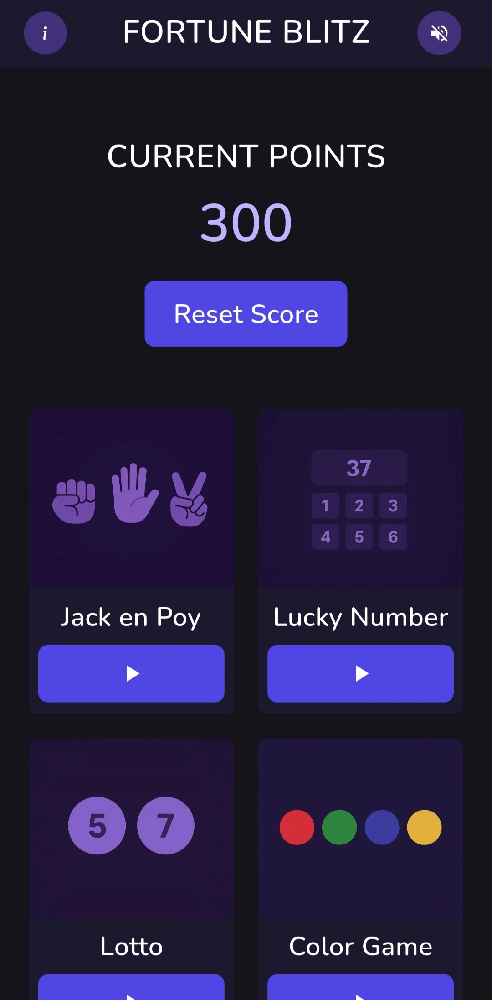

# Fortune Blitz  
Fortune Blitz is a mobile game app developed using Flutter that brings together multiple mini-games into a single platform, offering players an engaging experience that combines entertainment and cognitive challenges.  

Designed for fun and skill-building, the app allows users to play a variety of classic and casual games while tracking their progress through a points-based system. Fortune Blitz ensures a smooth, responsive, and visually appealing user experience, making it enjoyable for players of all ages.  

## Key Features  
**Five Exciting Mini-Games:**  
   - ✊✋✌️ **Jack en Poy** (Rock-Paper-Scissors)
   - 🔢 **Lucky Number** (Number Guessing Game)
   - 🎟️ **Lotto** (Random Draw)
   - 🎨 **Color Game** (Inspired by Filipino carnival games)
   - 🎰 **Slot Machine** (Match letters as HAU, SOC, or WEB)

**Interactive UI** - Clean, responsive, and user-friendly interface.  
**Points System** - Earn points based on game performance.  
**Sound Effects & Background Music** - Immersive audio experience with customizable settings.  
**State Management** - Efficient handling of game progress and audio across all screens.  
**Offline Play** - No internet connection required.  

## Screenshot/Preview  

## Tools and Technologies 
Fortune Blitz was built with **Flutter** and **Dart**, utilizing various libraries and custom-built components for optimal performance and user experience.

### App Architecture  
- **Framework & UI**: Flutter, Material
- **State Management**: GetX (navigation & reactivity), Provider (audio control)
- **Audio**: Flame Audio, AudioController (sound settings)
- **UI Styling**: Custom theme system, Theme.dart, Flutter Launcher Icons
- **Game Logic**: Custom mini-game logic, GameController (score tracking), modular layout
- **Assets**: Royalty-free audio, custom graphics & icons

### Deployment & Testing
- **Platform Target**: Android and iOS
- **Testing**: Manual testing (bugs, audio responsiveness, game flow)
- **App Store Readiness**: Google Play Protect validated (safe for future distribution)

## How to Play  
1. **Open the App:** Start from the home screen, where you’ll see your total points.  
2. **Select a Game:** Tap on any of the available mini-games.  
3. **Play & Earn Points:** Follow the game mechanics to win and increase your score.  
4. **Check Progress:** The home screen updates dynamically with your new points.  
5. **Reset Points (Optional):** If needed, reset your total score from the home screen.  
6. **Toggle Sound:** Mute/unmute background music anytime using the button at the top right.  

## Development Team and Contributors
### Core App/Game Developers
_These members were directly responsible for planning, designing in Figma, coding in Flutter, and implementing the app._

| Name | Role |
|-|-|
| Jimwel Valdez [(@jimvdz)](https://github.com/jimvdz) | Project Lead / App Developer / UI/UX Designer |
| Christine Jasline Natividad [(@itsjayceee)](https://github.com/itsjayceee) | App Developer / UI/UX Designer |
| Kate Anne David [(@K8Dvd)](https://github.com/K8Dvd) | App Developer / UI/UX Designer |  
  
### Contributing Members  
_These members contributed during the early planning and Figma design stages of the project._

| Name | Contribution |
|-|-|
| Chester Jonathan Tayag | Game Concepts / UI Design |
| Luis Miguel Cayanan | UI Design |
| Bryan Aaron Santiago | UI Design |  

Copyright &copy; 2025 by Valdez, Natividad, David, Tayag, Cayanan, and Santiago. All rights reserved.